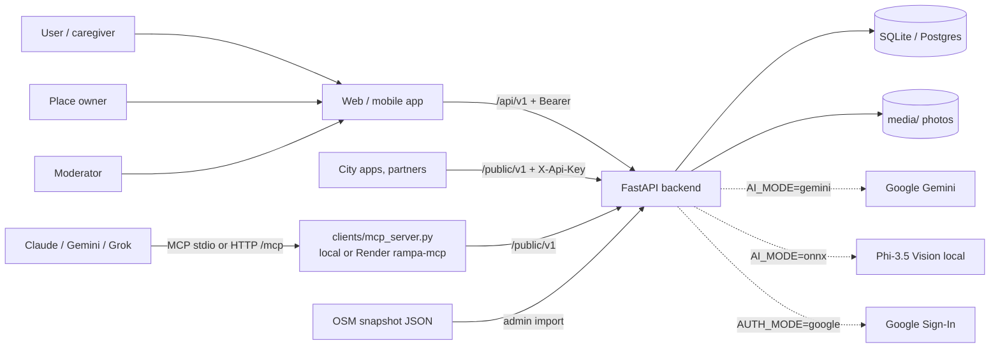

# Kraków bez barier — backend documentation

**Kraków bez barier** ("Yanosik dostępności") is a backend for a crowdsourced map of accessibility in Kraków. Users, place owners, the city and OpenStreetMap all submit **observations** ("the elevator is broken", "there is a ramp"). The system turns them into a **current accessibility state** for each place feature, with a **confidence score**, **sources**, **history** and **conflict moderation**. It also answers the question users actually ask: *"Can I get in with a wheelchair?"*

## Documents

| Document | What's inside |
|---|---|
| [tech-stack.md](tech-stack.md) | Tech stack at a glance: Python/FastAPI, storage, AI models and fallbacks, OSM services, MCP, security, deploy |
| [architecture.md](architecture.md) | Hexagonal architecture, modules, domain model, trust and conflict rules, AI, OSM, persistence, design decisions and limits |
| [api.md](api.md) | Full HTTP API reference: conventions, auth, errors, every endpoint with real request/response examples |
| [configuration.md](configuration.md) | Every setting (`.env` ↔ `app/config.py`), defaults, modes |
| [operations.md](operations.md) | Run, test, **Render deploy (auto after merge to `master`)**, demo script, MCP in Claude, Gemini/ONNX, Google login, troubleshooting |
| [mcp.md](mcp.md) | MCP for AI assistants: tools, local stdio vs remote HTTP, deploy as a separate Render service, connecting Claude / Gemini CLI / Grok |
| [PITCH.md](PITCH.md) | 90-second pitch, evidence, architecture slide, Q&A |
| [DEMO.md](DEMO.md) | Stage demo script: pre-flight checks, every click and expected result, fallbacks |
| [openapi.json](openapi.json) | Machine-readable OpenAPI 3.1, exported from the app (`uv run python scripts/export_openapi.py`) |

More detailed material is elsewhere in the repo:
- **Feature plans and contracts**: [`../features/`](../features). Each feature F0–F10 has a `plan.md` with scope, tasks and DoD, and most have an `openapi.yaml` contract.
- **Clickable end-to-end requests**: [`../requests/demo.http`](../requests/demo.http) (VS Code REST Client).
- **Implementation status and log**: [`../STATUS.md`](../STATUS.md).

## 60-second quick start

```bash
uv sync                      # once, online
uv run pytest                # ~390 tests, offline, ~10 s
uv run python main.py        # http://localhost:8000 → Swagger UI (/docs)
```

Log in as a demo user and ask the core question:

```bash
curl -X POST localhost:8000/api/v1/auth/demo -H "Content-Type: application/json" -d '{"username":"anna"}'
curl "localhost:8000/api/v1/places/plc_mnk/check?profile=wheelchair"
```

## System at a glance



| Capability | Endpoint(s) | Feature |
|---|---|---|
| Search places by required accessibility features | `GET /api/v1/places?features=…` | F2 |
| "Can I get in?" for 7 needs profiles (wheelchair, crutches, stroller, blind, low vision, deaf, assistance dog) | `GET /api/v1/places/{id}/check?profile=` | F2/F14 |
| Place screen: activity feed, gallery, "Potwierdzone dzisiaj" badge | `/places/{id}/activity`, `/photos`, `verification` | F12 |
| Report a change with a photo | `POST /uploads`, `POST /reports` | F3 |
| Community confirmations 👍/👎 | `POST /observations/{id}/votes` | F3 |
| Automatic conflict detection → moderation | `GET /admin/queue`, `POST …/decision` | F3/F4 |
| AI suggestions from photos (mock / Phi-3.5 / Gemini) | `POST /ai/image-tags` | F6/F10 |
| Owner panel (verified owner observations) | `/owner/*` | F7 |
| Admin dashboard tiles + audit trail | `/admin/stats`, `/places/{id}/history` | F13 |
| Open data import (OpenStreetMap) | `POST /admin/imports` | F8 |
| Open API for external apps | `/public/v1/*` | F5 |
| AI assistant integration (MCP) | `clients/mcp_server.py` | F8 |
| Persistence (SQLite or Postgres via SQLAlchemy) | — | F9/F11 |
| Docker (Postgres + API) | `docker compose up -d --build` | F11 |
| Favourites, my reports | `/me/*` | F16 |
| Location search, map markers, categories, search suggestions | `/places?lat&lon&bbox&sort&view=map`, `/categories`, `/geocode` | F17 |
| Report drafts ("Zapisz szkic") | `POST /reports {draft}`, `PATCH`, `/submit` | F18 |
| AI from text | `POST /ai/parse-text` | F19 |
| Similar places, accessible route A→B (heuristic) | `/places/{id}/similar`, `/routes/accessible` | F20 |
| Moderation extras: confidence, comments, abuse flag, merge, revalidate, ownership requests | `/admin/*`, `/owner/ownership-requests` | F21 |
| Owner panel: profile, stats, edit, opening hours, photos, reply/approve, reminders, suggestions, batch, CSV | `/owner/*` | F22 |
| `partial` state, data ageing, temporary issues with end date, place types | across the API | F23 |
