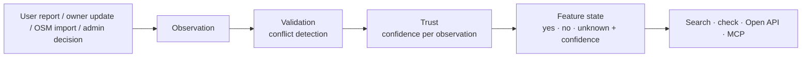
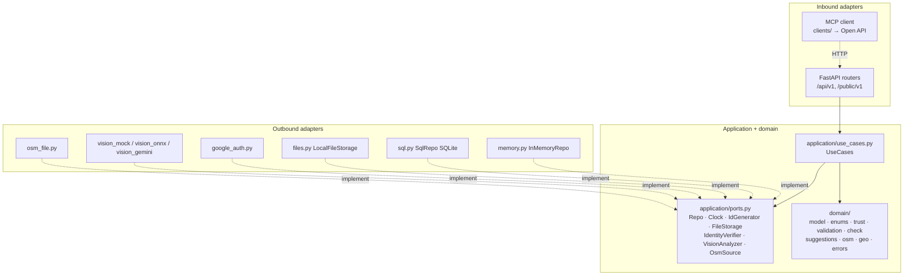
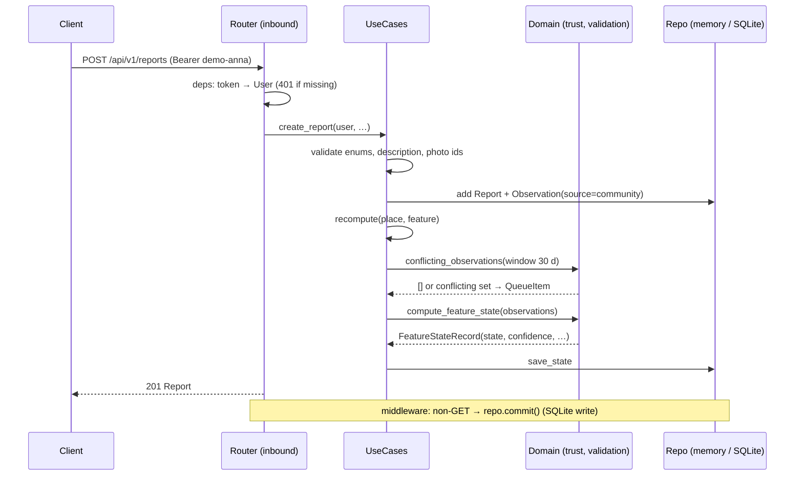

# Architecture

## 1. Core idea: observations, not flags

The system never stores "this place is accessible: true". It stores **observations**: single statements about a single feature, each with a source, author, time, optional photo evidence and community votes. The visible state is always **computed**:

This gives every piece of information a **source, a date, a history, evidence and a confidence level**. Nothing is overwritten. An owner's "repaired" statement does not erase users' "broken" reports; it becomes another observation, and conflicts go to a moderator.

## 2. Hexagonal architecture (ports and adapters)

**Dependency rule:**
- `domain` imports only the standard library.
- `application` imports `domain` and its own ports.
- FastAPI, SQLAlchemy, httpx, google-auth and onnxruntime appear **only in adapters** and in `bootstrap.py`, the composition root.

Benefits in practice:
- Every external dependency has an offline or mock twin, chosen by config: `REPO_MODE`, `AUTH_MODE`, `AI_MODE`. The demo never depends on the network.
- Use cases are tested on in-memory fakes in milliseconds.
- The same use cases serve the internal API, the Open API and, through the Open API, the MCP tool.

### Module map

| Path | Role |
|---|---|
| `main.py` | Entry point (`uv run python main.py`) |
| `app/config.py` | `Settings` (pydantic-settings, `.env`) — see [configuration.md](configuration.md) |
| `app/bootstrap.py` | Composition root: picks adapters by config, seeds an empty store |
| `app/seed.py` | Deterministic demo data: 4 places, 7 demo accounts, system authors |
| `app/domain/model.py` | Entities and value objects (dataclasses) |
| `app/domain/enums.py` | `FeatureKey`, `StateValue`, `ObservationSource`, `Role`, … + Polish labels |
| `app/domain/trust.py` | Confidence per observation, winner → feature state |
| `app/domain/validation.py` | Conflict detection (30-day window) |
| `app/domain/check.py` | "Can I get in?" rules per needs profile |
| `app/domain/suggestions.py` | AI photo analysis → tags and report-form suggestion |
| `app/domain/text_parse.py` | Free text → suggested observations (rules, PL + EN) |
| `app/domain/verification.py` | Place badge ("Potwierdzone dzisiaj") + activity-feed classification |
| `app/domain/history.py`, `stats.py` | Audit trail of a place; admin dashboard tiles |
| `app/domain/route.py` | A→B route heuristic (barriers/helpers near a straight line) |
| `app/domain/osm.py`, `geo.py` | OSM tag mapping; haversine, bbox, distance to a segment |
| `app/application/ports.py` | Port protocols |
| `app/application/use_cases.py` | All use cases (`UseCases` class) |
| `app/adapters/inbound/http/` | `main.py` (app factory, middleware), `deps.py` (auth deps), `errors.py`, `schemas.py`, `rate_limit.py`, `routers/*` |
| `app/adapters/inbound/http/routers/` | `auth`, `me`, `places` (search, map, card, check, similar, routes, history), `observations` (reports, drafts, votes, uploads), `ai`, `owner`, `admin`, `public` |
| `app/adapters/outbound/` | `memory.py`, `sql.py`, `files.py`, `google_auth.py`, `vision_*.py`, `osm_file.py` |
| `clients/` | MCP server + tool logic (Open API client) |
| `data/` | OSM snapshot; SQLite DB file (`rampa.db`, gitignored) |
| `media/` | Uploaded photos (gitignored) |
| `features/` | Per-feature plans and OpenAPI contracts |
| `tests/` | `unit/` (domain), `application/` (use cases on fakes), `adapters/` (SQL, Gemini), `api/` (HTTP, contract, demo flow, MCP tools) |

## 3. Request lifecycle

Example: a user reports a broken elevator with a photo.

- **Atomicity:** each use case runs as one synchronous block, with no `await` between reading and writing state, so it is atomic on the asyncio event loop.
- **Errors:** domain exceptions (`NotFound`, `Forbidden`, `ValidationFailed`, …) are mapped to the uniform error JSON in `inbound/http/errors.py`.

## 4. Domain model

| Entity | Key fields | Notes |
|---|---|---|
| `Place` | id, name, category, `place_type`, location (`GeoPoint`), address, `owner_id`, `external_id`, `opening_hours`, `contact`, `photo_ids` (owner photos) | Descriptive data only; accessibility lives in states |
| `Observation` | place, feature, value `yes/partial/no`, source, author, created_at, temporary, `valid_until`, comment, evidence (photo ids), votes `{user: ±1}`, validation (`VALID/CONFLICT/REJECTED/FLAGGED`), `flag_reason`, confidence | Never deleted, only `validation` changes |
| `FeatureStateRecord` | place, feature, state `yes/partial/no/unknown`, confidence, temporary, last_verified, sources_count, validation, active_observation_id | **Computed**, never written by hand |
| `Report` | element, current_state `works/partially_works/not_working`, severity, nature, description, photos, status `draft/submitted`, observation_ids, owner `replies`, `owner_status` | The UI form; a draft may be incomplete; on submit it creates one observation |
| `QueueItem` | place, feature, observation_ids, status `open/resolved`, decision, `resolved_at`, moderator `comments` | One open item per place + feature |
| `OwnershipRequest` | place, user, justification, status `pending/approved/rejected`, decided_at | "I'm the owner" → admin verifies |
| `User` / `Session` | role `user/owner/admin`; demo username or Google `sub`; `favorite_place_ids` | Guest = no user |
| `Photo` | path, url, original_name | Stored in `media/` |

**Place types:** `venue`, `shop`, `public_transport_stop`, `platform`, `parking`, `office`, `street_segment`, `other`.

**Accessibility features (35, 8 groups):**
- *entrance*: `step_free_entrance`, `ramp`, `elevator_entrance`, `wide_doors`, `automatic_doors`, `call_bell`
- *inside*: `elevator`, `escalator`, `spacious_interior`, `high_contrast_info`, `tactile_info`
- *toilet*: `accessible_toilet`, `adult_changing_table`, `turning_space`, `extra_accessible_toilets`
- *hearing*: `induction_loop`, `sign_language_interpreter`, `video_captions`, `fm_system`
- *vision*: `braille`, `tactile_paths`, `good_lighting`, `high_contrast_markings`, `accessible_digital_materials`, `audio_description`
- *mobility*: `lowered_curb`, `platform_elevator`, `crutches_friendly`
- *parking*: `disabled_parking`, `marked_parking`, `level_surface`, `more_than_n_spots`, `drop_off_zone`
- *other*: `assistance_dog_allowed`, `pets_allowed`

This is the full model from the contract plus `escalator` (requested by the front end). `partially_inaccessible_exhibition` is left out because its meaning is inverted (`yes` = bad). For the front end: `tactile` → `tactile_paths`, `sign` → `sign_language_interpreter` (to confirm).

## 5. Rules

### 5.1 Trust (`domain/trust.py`)

Confidence of a single observation:

| Component | Value |
|---|---|
| Source weight | `admin` 1.0 · `verified_owner` 0.85 · `open_data` (OSM) 0.6 · `community` 0.5 |
| Photo evidence | +0.1 |
| Each 👍 | +0.1, capped at +0.3 |
| Each 👎 | −0.1 |
| Clamp | [0, 1] |
| Age | older than **180 days** → ×0.5 |
| Round | 2 decimals |

Feature state:
1. Ignore `REJECTED` and `FLAGGED` observations, and temporary issues whose `valid_until` has passed. Expired issues are refreshed lazily on read (`get_accessibility`, `check`, search).
2. The winner is the observation with the highest confidence. Ties go to the newer one, then to the later-inserted one.
3. `state` is the winner's value. `confidence`, `temporary` and `last_verified` also come from the winner.
4. With no observations, the state is `unknown` and confidence is 0.

> Example (demo): seed `yes` 0.5 (60 days old) → Anna `no` + photo 0.6 → +3 👍 = 0.9 → state `no`.

### 5.2 Conflicts (`domain/validation.py`)

- **Window:** active observations (not `REJECTED`/`FLAGGED`, not expired) from the last **30 days**.
- **Conflict:** the window has **≥ 2 distinct values** and **≥ 2 distinct authors**.
- **When it happens:** the observations are marked `CONFLICT`, a `QueueItem` is opened (or extended), and the state's `validation` is `CONFLICT`.
- Seed data is 60 days old, so the first fresh report never conflicts with it.
- **Admin `confirm`** (with a winning observation):
  - the winner and observations with the same value become `VALID`;
  - observations with the opposite value become `REJECTED`;
  - a new `admin` observation (weight 1.0) is added;
  - the item is resolved.
- **Admin `reject`:** all observations in the item become `REJECTED`, and the state falls back to older data.
- **Abuse:** an admin can flag any observation (`FLAGGED` + reason). It is excluded like `REJECTED`, and the history keeps it.

### 5.3 "Can I get in?" (`domain/check.py`)

A generic rule table per needs profile:

| Profile | Required (at least one `yes`) | Downgrade to `partial` if `no` |
|---|---|---|
| `wheelchair`, `stroller` | `step_free_entrance` · `ramp` | `elevator` |
| `crutches` | `step_free_entrance` · `ramp` · `crutches_friendly` | `elevator` |
| `blind` | `tactile_paths` · `braille` | — |
| `low_vision` | `good_lighting` | — |
| `deaf` | `induction_loop` · `sign_language_interpreter` | — |
| `assistance_dog` | `assistance_dog_allowed` | — |

How the answer is chosen:
- a required feature is `yes` → `yes`, or `partial` if a downgrade feature is `no` (e.g. "you get in, but the lift is broken");
- no required feature is `yes`, but one is `partial` → `partial`;
- required features are known but none is `yes` or `partial` → `no`;
- no data → `unknown`.

Each profile has its own advice text. Confidence is the minimum of the states used, and `reasons` and `active_issues` only contain features relevant to the profile. These rules answer the brief's questions: assistance dog, kerb, platform lift, lighting, crutches.

### 5.4 AI suggestions (`domain/suggestions.py` + vision adapters)

- `VisionAnalyzer` returns `ImageAnalysis`: `real_place`, `barrier_detected`, `barrier_type`, `affected_disabilities`, `description`, `confidence`. All models share one prompt and schema (`vision_prompt.py`).
- **Keyword mapping** (PL + EN) turns the analysis into feature tags (winda, wejście bez schodów, podjazd, …) plus `awaria` and `tablica informacyjna`.
- **Suggestion** (only when a barrier is detected): element = first feature, state = `not_working`, severity = `critical` if wheelchair, mobility or physical impairment is affected, otherwise `obstacle`.
- **Several photos:** non-real ones are skipped, tags are merged, and the most confident analysis wins. If none is real, the call returns 400 `NOT_A_REAL_PLACE`.
- **AI is a suggestion only.** It fills the report form and never changes feature state.
- **Models:** `mock` (deterministic, offline), `onnx` (Phi-3.5 Vision locally), `gemini` (Google Gemini REST, retries 429/5xx). The real models are wrapped in `FallbackVisionAnalyzer`: any error or timeout returns the mock answer, so the demo never breaks.

### 5.5 OSM import (`domain/osm.py`)

- **Input:** `data/osm_krakow_tauron.json`, a snapshot made by `get_from_api.py` from Overpass.
- **Tag mapping:**
  - `wheelchair` `yes`/`limited`/`no` → `step_free_entrance` `yes`/`partial`/`no`;
  - `toilets:wheelchair` `yes`/`limited`/`no` → `accessible_toilet`.
- OSM-created places get `place_type: other`.
- **Places:** matched by `external_id` (`osm:<lat>,<lon>`) or by the same name within **50 m**; otherwise a new `plc_osm_N` is created. Unnamed points are skipped.
- **Observations:** source `open_data` (0.6), author `usr_osm` "OpenStreetMap". **Idempotent:** an identical observation is not added twice.

### 5.6 Roles and sources

| Role | Can | Observation source |
|---|---|---|
| guest | read places, check, Open API (with key) | — |
| user | report (incl. drafts), observe, vote, upload, AI, favourites, apply for ownership | `community` |
| owner | + owner panel for **own** places: edit, opening hours, photos, reply/approve reports, reminders, suggestions, batch, CSV | `verified_owner` on own places, `community` elsewhere |
| admin | + moderation (decide, comment, flag, merge, revalidate), imports, ownership verification, stats, audit, demo reset | `admin` |

Public display names are shortened to "Anna K." (privacy rule from the mock-ups).

### 5.7 Derived views (pure functions over observations)

| View | Module | Rule |
|---|---|---|
| Place badge `verification` | `verification.py` | from known states: newest `last_verified`, mean confidence (high ≥ 0.8, medium ≥ 0.5); status conflict · confirmed today · ≤ 30 d · ≤ 90 d · needs update |
| Activity feed | `verification.activity_type` | one item per observation, newest first: issue reported · confirmation · owner update · admin decision · OSM import · initial data |
| Audit trail | `history.py` | observations + conflict detected/resolved (`resolved_at`) |
| Dashboard tiles | `stats.py` | today vs yesterday: reports, open conflicts, low confidence, observations, abuse flags, places |
| Search | `use_cases.find_places` | features AND, category, text, place type, distance + radius, bbox, sort (nearest/name/recently verified), pages, map markers |
| Route A→B | `route.py` | straight line; street-level features of places ≤ 100 m: `no` = barrier, `yes` = helper; `partial`/`yes`/`unknown` |
| Text → observations | `text_parse.py` | clauses + polarity keywords (PL/EN), stairs/step-free special cases, temporary words |

## 6. Persistence (`REPO_MODE`)

- **`memory`:** `InMemoryRepo`, plain dictionaries. Used by tests and ad-hoc runs; data is lost on restart.
- **`sql`** (default): `SqlRepo`, a **write-behind cache** over **SQLite or Postgres** via SQLAlchemy Core (same code; `DB_ENGINE`, `Settings.db_url`, Postgres via `psycopg`).
  - On start: `create_all` (retried while a Postgres container is still booting), then load every row into memory, ordered by `seq` so insertion order and tie-breaks are preserved.
  - After every non-GET request, middleware calls `repo.commit()`. It diffs the current rows against a snapshot of the last commit and issues the needed `INSERT`, `UPDATE` and `DELETE` statements.
  - Datetimes are stored as ISO strings to keep time zones; lists and dicts are stored as JSON.
  - At bootstrap: an empty DB is seeded. A non-empty DB is loaded, and the id counters continue past the stored ids so new ids never collide.
  - Tables: `users`, `sessions`, `places`, `feature_states`, `observations`, `reports`, `photos`, `queue_items`, `ownership_requests`.
- **Why write-behind:** the `Repo` port is synchronous and the use cases mutate domain objects in place. This adds persistence without touching the domain or use cases.
- **Schema evolution:** on start, `SqlRepo` adds any **missing nullable columns** to existing tables (`ALTER TABLE … ADD COLUMN`), so databases created by older versions keep working (e.g. `queue_items.resolved_at`, F13). It never drops or renames anything.
- **Limit:** a single process only (one uvicorn worker), on both SQLite and Postgres. Multiple workers or replicas would need a fully SQL-backed repository; the port stays the same.
- **Deployment:** `docker-compose.yml` = `postgres:17-alpine` (healthcheck, volume `pgdata`) + the API image (`Dockerfile`, uv, Python 3.13, extra `postgres`). Verified: the full `demo.http` and the SqlRepo test suite pass on Postgres.

## 7. Auth

- **`AUTH_MODE=demo`** (default):
  - `POST /auth/demo {"username"}` returns the token `demo-<username>`;
  - demo tokens are **stateless** (resolved by username), so they survive a demo reset;
  - accounts: `anna`, `jan`, `ola`, `piotr`, `marek` (users), `ewa` (owner of `plc_mnk` and `plc_camelot`), `admin`.
- **`AUTH_MODE=google`:**
  - the front end gets a Google ID token (Google Identity Services);
  - `POST /auth/google` verifies it (signature, audience, expiry, issuer, verified e-mail) via `google-auth`, in a worker thread;
  - the user is upserted by Google `sub`, and e-mails in `ADMIN_EMAILS` get the admin role;
  - the response is an opaque session token (24 h TTL).
- **Open API:** the `X-Api-Key` header (`PUBLIC_API_KEYS`), with a per-key fixed-window rate limit (`PUBLIC_RATE_LIMIT_PER_MIN`, default 60) → 429 with `Retry-After`. App Bearer tokens are not accepted there.

## 8. MCP integration

`clients/mcp_server.py` (FastMCP, optional extra `mcp`) exposes two tools to AI assistants:
- `check_accessibility(place_name, profile="wheelchair")`
- `search_accessible_places(features)`

It is a **client of the Open API**, not part of the backend process. With in-memory data, a separate process would not see the app's live data, and going through the public API proves that external integrations work. If the backend is down, a tool returns `{"error": …}` instead of crashing.

## 9. Design decisions and known limits

| Decision | Why | Cost / limit |
|---|---|---|
| Observations + computed state | Trust, history, conflicts, "Yanosik" model | More logic than a flag; mitigated by pure, tested domain functions |
| Hexagon with mock/offline adapters | Offline, deterministic demo; fast tests | More files; ports only where there are ≥2 implementations |
| Sync `Repo` + write-behind SQLite | Atomic use cases, persistence without a rewrite | Single process |
| 35 features, states `yes/partial/no/unknown` | Full model + `escalator`; all user questions from the brief | Only some features take part in `check` rules; the rest are informational |
| Route A→B as a heuristic | No routing engine needed; honest `note` | Not turn-by-turn; only barriers near a straight line |
| `/geocode` from the local index | Offline demo | No address search outside known places |
| AI = suggestion only + fallback | AI never corrupts data; demo never breaks | Keyword mapping is simple (PL/EN) |
| Open API mounted at `/public/v1` | Separate versioning from the internal API | Differs from the full contract (`/api/v1/public/v1`) |
| OSM from a snapshot | Overpass timed out on the corporate network | No live import (port ready) |
| Ownership: admin assigns, or user applies → admin verifies | Both flows from the full plan | No document upload for proof of ownership |
