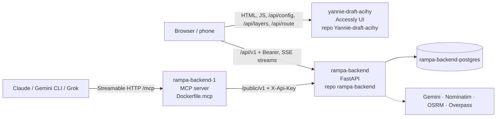

# Deployment: Rampa backend + Accessly front end

The whole system runs on **Render**: three web services and one Postgres. Each service is built from **Docker** and deploys **automatically** when its branch gets a new commit.



The browser calls Rampa **directly**. The Accessly server only serves the page, the city's map layers and wheelchair routes, so all accessibility data lives in Rampa.

## 1. Services

| Service | URL | Repo · branch that deploys | Build |
|---|---|---|---|
| Backend `rampa-backend` | https://rampa-backend.onrender.com (`/docs`, `/health`) | `HakerSII/rampa-backend` · **`master`** | `Dockerfile` (uv, extras `postgres` + `ai`, 1 uvicorn worker, port 8000) |
| Postgres `rampa-backend-postgres` | internal only (`dpg-…`) | — | Render Postgres, wired through `DATABASE_URL` |
| MCP | https://rampa-backend-1.onrender.com/mcp (`/health`) | `HakerSII/rampa-backend` · **`master`** | `Dockerfile.mcp` (FastMCP, port 8080), details in [mcp.md §4](mcp.md#4-deploy-on-render-separate-service) |
| Front end (Accessly) | https://yannie-draft-acihy.onrender.com | `Yannie-draft-acihy` · **`adjust_to_backend`** (the version adapted to Rampa) | `accessly/Dockerfile` (Python stdlib server, port 8000). This repo belongs to the front-end team, so ask them before changing its Render settings |

Free-plan notes:
- The first request after idle wakes the service up (cold start, ~30–60 s).
- The CPU is a fraction of a core, so keep request handling cheap (F56: the map query went from 5–30 s to well under 1 s).
- The container disk is ephemeral: uploaded photos in `media/` are lost on redeploy. Data in Postgres stays.

## 2. Release flow

**Backend (Rampa)**
1. Work on a feature branch (currently `feat/mvp-backend`): TDD commits, `uv run pytest` green, `uv run python scripts/export_openapi.py` if the API changed.
2. Push, open a PR into `master`, merge.
3. Render builds the image and replaces the backend and MCP services. No manual step is needed, and unfinished work must not reach `master`.
4. At start the app runs the schema migrations (new tables, missing columns; the log shows `schema: added column …`) and seeds an empty database once.

**Front end (Accessly)**
1. Commit to `adjust_to_backend` and push. Render redeploys `yannie-draft-acihy`.
2. Changes from the team's `main` come in by **merge** (`git merge origin/main`), not rebase, and the backend stays in Rampa.
3. Check before pushing: `scripts/test.sh` (stdlib unittest; includes the i18n test: every UI text in EN/DE/UK).

**Order when both change:** deploy the backend first, because the UI calls the new endpoints. Old endpoints stay until the UI no longer uses them.

## 3. Configuration

Settings are environment variables in the Render dashboard (service → **Environment**). Secrets live **only** there, never in git (`.env` and `.mcpenv` are gitignored and dockerignored).

**`rampa-backend`.** Every variable is described in [configuration.md](configuration.md); the template is `.env.example`. These are the ones that matter on Render:

| Variable | Production value / note |
|---|---|
| `DATABASE_URL` | Render Postgres internal URL (secret) |
| `TRUSTED_PROXY_HOPS` | `1`: rate limits count the real client IP, not Render's proxy |
| `AUTH_MODE` | `demo` (seeded accounts; the panels sign in with `admin@demo.pl`, `ewa@demo.pl`) |
| `GEOCODER` / `ROUTER` | `nominatim` / `osrm` for live OSM; any failure falls back to the offline data |
| `AI_MODE`, `GEMINI_API_KEY`, `GEMINI_MODEL` | photo analysis; `gemini` with the key (secret) |
| `AI_VISION_FALLBACK` | `mock` (default) or `onnx` |
| `CHAT_MODE`, `AI_RECOMMENDER` | `rules` on the free plan. `onnx` needs the local Phi-3.5 model: it is downloaded at start (F48, `AI_MODEL_DOWNLOAD`) only when there is enough RAM (`AI_MODEL_MIN_RAM_MB`, default 3500); otherwise rules answer |
| `PUBLIC_API_KEYS` | must contain the key the MCP service uses (`RAMPA_API_KEY`) |

**MCP service:** `RAMPA_API_URL=https://rampa-backend.onrender.com`, `RAMPA_API_KEY`, optionally `MCP_AUTH_TOKEN`. See [mcp.md](mcp.md).

**`yannie-draft-acihy`:**

| Variable | Default | Note |
|---|---|---|
| `ACCESSLY_API_BASE` | `https://rampa-backend.onrender.com` | the Rampa the browser talks to |
| `ACCESSLY_PUBLIC_URL` | address the page was opened from | link in the sign-in QR code |
| `ACCESSLY_PLAY_URL` | none → "Wkrótce w Google Play" badge | Google Play link once the app exists |
| `ACCESSLY_ORS_KEY` | none | OpenRouteService key for wheelchair routes |
| `ACCESSLY_CITY` | `krakow` | city file in `accessly/cities/` |

## 4. Data in production

- **Seed:** an empty database gets the demo places and accounts once at start.
- **Catalogue of Kraków places** (6545 places with categories, opening hours and accessibility facts): run once after a fresh database, as admin. The import is idempotent, so running it again only fills gaps.
  ```http
  POST https://rampa-backend.onrender.com/api/v1/admin/imports
  Authorization: Bearer demo-admin
  Content-Type: application/json

  {"source": "catalog"}
  ```
- **OpenStreetMap** (`{"source":"overpass"}`): only on admin request.
- **Never reset production** (`/admin/demo/reset`) unless you mean to wipe it.

## 5. After a deploy: smoke test (~2 min)

| Check | Expected |
|---|---|
| `GET https://rampa-backend.onrender.com/health` | `"status":"ok"`, `"storage":"sql"`, `"database":"postgresql"`, plus `ai_mode`, `chat` and `local_model` state |
| `GET /api/v1/places?view=map&bbox=19.90,50.04,19.97,50.08` | answers in < 2 s (warm) |
| `GET /api/v1/ai/chat/status` | `mode` as configured; `state` is `rules`, `loading`, `ready`, `error` or `off` |
| `GET https://rampa-backend-1.onrender.com/health` | ok; `requests/mcp.http` against `/mcp` lists the tools |
| Open https://yannie-draft-acihy.onrender.com | sign-in screen with QR, "Kontynuuj bez logowania" → map with markers |
| Search "Teatr Słowackiego" → card → Szczegóły / Opinie / Trasa | place found, card tabs filled |
| `/chat`: "czy do teatru na Słowackiego wjadę wózkiem?" | stream: tool calls (`find_location` → `places_nearby` / `check_accessibility`), then the answer |

Full clickable flow: `requests/demo.http` with `@base = https://rampa-backend.onrender.com`.

## 6. Troubleshooting

| Symptom | Cause / fix |
|---|---|
| First request hangs ~1 min | cold start on the free plan; wait, then it is fast |
| Map request slow (> 5 s) on warm service | a deploy without F56 (`master` older than `9d76932`), or the log shows long requests: check Render → Logs |
| UI shows no data | wrong `ACCESSLY_API_BASE`, or the backend is down or waking up (`/health`) |
| Photos disappeared | ephemeral disk: a redeploy wipes `media/` |
| AI answers `model: mock` | missing or over-quota `GEMINI_API_KEY`; see the log line `vision model failed (…) → mock` |
| Chat answers with rules only | `CHAT_MODE=rules`, or the model is not loaded (too little RAM, download failed): see `/health` → `local_model` |
| Local start hangs on DB connection | you used Render's internal `dpg-…` URL locally; use SQLite or Docker (see [operations.md](operations.md)) |
