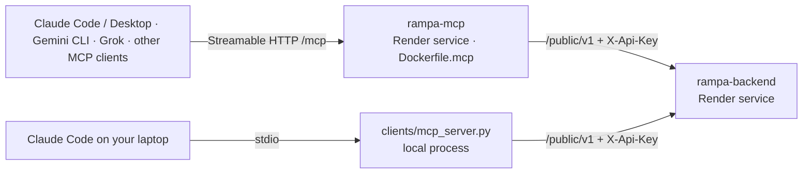

# MCP: Kraków bez barier in AI assistants

The MCP server lets an AI assistant (Claude, Gemini CLI, Grok and others) answer *"Can I get in?"* from our live data, with sources and confidence, instead of guessing.

- Code: `clients/mcp_server.py` (FastMCP) and `clients/rampa_tools.py` (the tool logic).
- Plans: [F8](../features/08-osm-mcp/plan.md) (stdio) and [F41](../features/41-remote-mcp/plan.md) (remote over HTTP).
- The server is a **client of the Open API** (`/public/v1`, header `X-Api-Key`). It has no database of its own, so it always shows what the backend shows.



## 1. Tools

| Tool | Input | Output |
|---|---|---|
| `check_accessibility` | `place_name` (text), `profile` = `wheelchair` (default) · `crutches` · `stroller` · `blind` · `low_vision` · `deaf` · `assistance_dog` | `{query, profile, matches: [{place, answer: yes/partial/no/unknown, confidence, advice, accessibility}], total_found}`. Unknown place → `{matches: [], message: "Nie znaleziono …"}` |
| `search_accessible_places` | `features`: list of feature keys, all required (e.g. `["step_free_entrance", "elevator"]`; full list `GET /api/v1/accessibility/features`) | `{features, places: [{id, name, address, accessibility_summary}], total}` |

The tools never raise. Backend errors come back as `{"error": "…"}`, so the assistant can tell the user that the data is unavailable.

## 2. Two ways to run it

| | Local (stdio) | Remote (Streamable HTTP, F41) |
|---|---|---|
| For | Claude Code on the same machine as the backend | any MCP client, anywhere |
| Start | started by the client (`.mcp.json`) | `MCP_TRANSPORT=http uv run --extra mcp python -m clients.mcp_server` or `Dockerfile.mcp` |
| URL | — | `https://<mcp-service>/mcp`, plus `GET /health` |
| Auth | none (local) | optional `MCP_AUTH_TOKEN` → `Authorization: Bearer <token>` |

### Configuration (MCP process)

The MCP service has **its own env file `.mcpenv`**, separate from the backend's `.env`. It is gitignored and dockerignored; the template is [`.mcpenv.example`](../.mcpenv.example). `clients/mcp_server.py` loads it at start (`MCP_ENV_FILE` sets another path), and variables already set in the environment win: the Render dashboard, compose wiring, `.mcp.json`.

Working values (verified 2026-10-03 against Render: `/health` ok, `/public/v1` accepts `demo-key`):

```bash
RAMPA_API_URL=https://rampa-backend.onrender.com
RAMPA_API_KEY=demo-key      # backend has no PUBLIC_API_KEYS set → default key; use a dedicated one in production
MCP_AUTH_TOKEN=             # empty = public (claude.ai connectors); set → Bearer required
```

| Variable | Default | Meaning |
|---|---|---|
| `RAMPA_API_URL` | `http://localhost:8000` | backend base URL (Render: the backend service URL) |
| `RAMPA_API_KEY` | `demo-key` | one of the backend's `PUBLIC_API_KEYS` |
| `MCP_TRANSPORT` | `stdio` (`http` in `Dockerfile.mcp`) | `stdio` = local child process · `http` = Streamable HTTP server |
| `PORT` | `8080` | HTTP port (Render sets it) |
| `MCP_AUTH_TOKEN` | — | **secret**. When set, `/mcp` requires `Authorization: Bearer <token>`; `/health` stays open. Leave it empty for claude.ai connectors (they support only no-auth or OAuth) |

The HTTP mode is stateless (no sessions), so restarts and Render's proxy don't break clients.

## 3. Run locally

```bash
uv run python main.py                                                     # backend :8000
# stdio (Claude Code starts it from .mcp.json — see operations.md §5)
# or HTTP, to test the remote setup on your machine:
MCP_TRANSPORT=http PORT=8080 uv run --extra mcp python -m clients.mcp_server   # → http://localhost:8080/mcp
```

With Docker: `docker compose up -d --build` also starts the `mcp` service (`Dockerfile.mcp`, port `MCP_PORT`, default 8080). It is wired to the `api` container (`RAMPA_API_URL=http://api:8000`); set `MCP_AUTH_TOKEN` / `RAMPA_API_KEY` in `.env` if needed.

Check it: `curl http://localhost:8080/health` → `{"status":"ok","transport":"http","path":"/mcp"}`. Then run [`requests/mcp.http`](../requests/mcp.http) (raw JSON-RPC: `initialize`, `tools/list`, `tools/call`) with VS Code REST Client.

## 4. Deploy on Render (separate service)

The MCP server is its **own web service**, next to `rampa-backend` and `rampa-backend-postgres`.

1. Render dashboard → **New → Web Service** → the same GitHub repo (`rampa-backend`), branch `master`.
2. **Runtime:** Docker. **Dockerfile path:** `Dockerfile.mcp`. Name it e.g. `rampa-mcp`.
3. **Environment:** Environment → *Add from .env* → paste your `.mcpenv`, or set the variables by hand:
   - `RAMPA_API_URL` = the backend URL (Render dashboard → `rampa-backend` → URL, e.g. `https://rampa-backend.onrender.com`).
   - `RAMPA_API_KEY` = a dedicated key. Add the same value to the backend's `PUBLIC_API_KEYS` (comma list), and drop `demo-key` in production.
   - `MCP_AUTH_TOKEN` (optional) = a long random string, if only your own clients should connect.
4. **Health check path:** `/health`.
5. Deploy. Like the backend, it redeploys automatically after every merge to `master`.
6. Check: open `https://<rampa-mcp>.onrender.com/health`, then point `@mcp` in `requests/mcp.http` at `https://<rampa-mcp>.onrender.com/mcp` and run it.

**Limits:**
- The tools are read-only.
- All MCP users share the backend rate limit of `RAMPA_API_KEY` (`PUBLIC_RATE_LIMIT_PER_MIN`, default 60/min); raise it if the assistant gets busy.
- On Render's free plan the first request after idle is slow (cold start).

## 5. Connect an assistant

Replace `<url>` with `https://<rampa-mcp>.onrender.com/mcp` (or `http://localhost:8080/mcp` locally).

**Claude Code (CLI):**
```bash
claude mcp add --transport http rampa <url>
# with MCP_AUTH_TOKEN:
claude mcp add --transport http rampa <url> --header "Authorization: Bearer <token>"
```

**Claude Desktop / claude.ai:** Settings → Connectors → *Add custom connector* → paste `<url>`. This needs `MCP_AUTH_TOKEN` to be empty, because these connectors accept only no-auth or OAuth.

**Gemini CLI:** `~/.gemini/settings.json`
```json
{ "mcpServers": { "rampa": { "httpUrl": "<url>", "headers": { "Authorization": "Bearer <token>" } } } }
```
Without a token, leave out `headers`.

**Grok and other clients:** any MCP client with Streamable HTTP takes the same `<url>` and, if needed, the `Authorization` header. See the client's own docs for where to enter them.

**Clients that only speak stdio:** bridge with `npx mcp-remote <url>` as the stdio command.

Then ask, for example: *„Czy wjadę na wózku do Muzeum Narodowego?”*, *„Które miejsca mają wejście bez schodów i windę?”*

## 6. Relation to `/ai/recommend`

| | MCP tools | `POST /ai/recommend` (F30, F40 A) |
|---|---|---|
| Who calls the model | the user's assistant (Claude, Gemini, Grok …) | our backend (`AI_RECOMMENDER=claude` or `gemini`), or no model at all (`rules`) |
| Tools executed? | yes, they return facts from the Open API to the assistant | no: the forced `set_filters` call only extracts filters; ranking and facts come from the DB |
| Schema | derived by FastMCP from the Python signatures | one shared schema in `app/domain/recommend.py` for Claude and Gemini |

## 7. Tests

| Test | What it checks |
|---|---|
| `tests/api/test_mcp_tools.py` | tool logic against the real app via ASGI |
| `tests/api/test_mcp_http.py` | the HTTP server in-process: health, `initialize`, `tools/list`, `tools/call`, the optional Bearer token |
| `requests/mcp.http` | live JSON-RPC calls; verified against `uvicorn` + `MCP_TRANSPORT=http` and a real FastMCP HTTP client |
