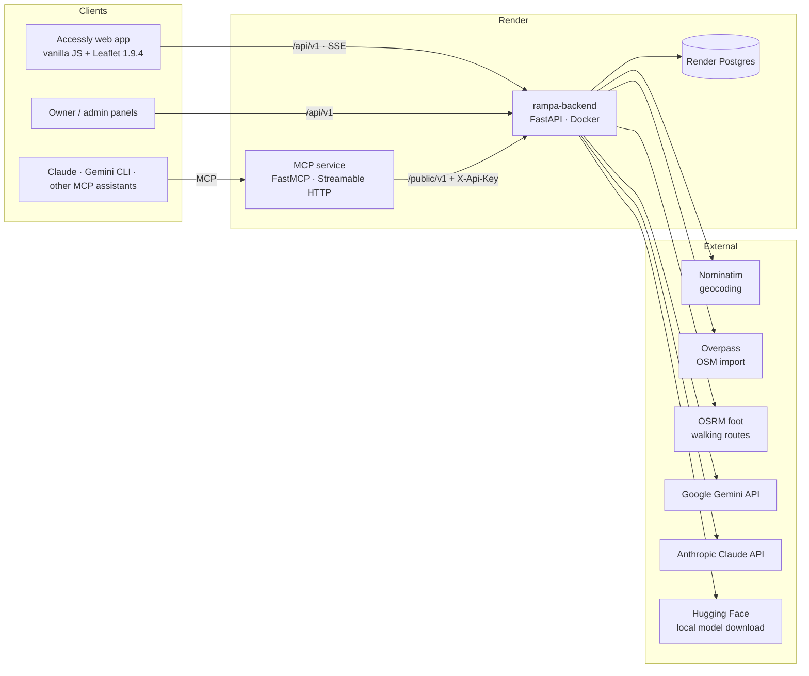

# Tech stack — Rampa (Kraków bez barier)

What the backend is built with, why, and where each part lives. Details: [architecture.md](architecture.md),
settings: [configuration.md](configuration.md), deploy: [operations.md](operations.md).

## At a glance

| Layer | Choice | Where |
|---|---|---|
| Language | Python 3.13 | `pyproject.toml` |
| Packages / env | uv (`uv.lock`, extras `ai`, `mcp`, `postgres`) | `pyproject.toml`, `uv.lock` |
| Web framework | FastAPI + Uvicorn, Pydantic v2, pydantic-settings | `app/adapters/inbound/http/` |
| Architecture | Hexagonal (ports & adapters): domain → use cases → adapters | `app/domain`, `app/application`, `app/adapters` |
| Storage | In-memory repo (tests, demo) or SQL write-behind repo on SQLAlchemy 2: SQLite locally, PostgreSQL 17 in production (psycopg 3) | `app/adapters/outbound/memory.py`, `sql.py` |
| Files | Local disk, served at `/media` | `files.py` |
| Auth | Demo tokens · anonymous device identity · e-mail code / link · Google Sign-In (google-auth) | `routers/auth.py`, `google_auth.py`, `mailer.py` |
| HTTP client | httpx (async), one lazy client per adapter | `osm_live.py`, `vision_gemini.py`, … |
| AI: photos | Google Gemini · local Phi-3.5 Vision (ONNX) · deterministic mock; fallback chain | `vision_*.py` |
| AI: recommendations | keyword rules · Claude · Gemini · local Phi-3.5 (one filter schema) | `recommender_*.py`, `domain/recommend.py` |
| AI: chat | Server chat: local Phi-3.5 or rules + MCP tools, streamed (SSE) | `application/chat.py`, `chat_onnx.py` |
| Local model runtime | onnxruntime-genai, model from Hugging Face (`microsoft/Phi-3.5-vision-instruct-onnx`, int4) | `phi_onnx.py`, `model_fetch.py` |
| Geo data | OpenStreetMap: Nominatim (search), Overpass (import), OSRM foot profile (routes), Accessly catalogue (6,545 places) | `osm_live.py`, `osrm.py`, `data/` |
| AI assistants | MCP server (FastMCP, Streamable HTTP, stateless) on the Open API | `clients/mcp_server.py`, `clients/rampa_tools.py` |
| Tests | pytest + pytest-asyncio (~760 tests, offline), OpenAPI contract tests, REST Client e2e | `tests/`, `features/*/openapi.yaml`, `requests/demo.http` |
| Containers | Docker (python:3.13-slim + uv), docker compose (API + MCP + Postgres) | `Dockerfile`, `Dockerfile.mcp`, `docker-compose.yml` |
| Hosting | Render: web service (Docker), Postgres, separate MCP service; auto-deploy on merge to `master` | [operations.md](operations.md) |

## Backend

- **FastAPI** — typed routers, Pydantic models, OpenAPI out of the box (`/docs`, exported to [openapi.json](openapi.json)).
  Streaming answers (photo check, chat) are Server-Sent Events via `StreamingResponse` with keepalive comments.
- **Hexagonal architecture** — the domain (`trust`, `validation`, `check`, `recommend`, …) is pure Python with no I/O;
  `UseCases` talks to ports (`Repo`, `VisionAnalyzer`, `Geocoder`, `ChatModel`, …); adapters are chosen in
  `app/bootstrap.py` from settings. Every external service has an offline fallback, so tests and the demo never need
  the network.
- **Observations, not flags** — accessibility facts are observations with source, author, time, evidence and votes;
  the visible state and its confidence are computed (see [architecture.md](architecture.md)).
- **Configuration** — `pydantic-settings`: environment variables / `.env`, one class `app/config.py`
  ([configuration.md](configuration.md)). Secrets (API keys, database URL) only in the environment.

## Data

- **PostgreSQL 17** (Render Postgres in production; `postgres:17-alpine` in compose) or **SQLite** for local runs,
  both through **SQLAlchemy 2 Core**. `SqlRepo` is a write-behind cache: the working set lives in memory, each write
  request commits the diff; an optimistic version lock lets several workers share the database; missing columns are
  added at start (`ALTER TABLE … ADD COLUMN`).
- **Seed + imports** — demo seed, OSM snapshot, live Overpass import, and the full Kraków catalogue
  (`data/krakow_catalog.json`, `POST /admin/imports {"source": "catalog"}`).
- **City config** — `data/cities/krakow.json` (centre, viewbox, areas, category groups); another city = another file.

## AI

| Use | Options (setting) | Fallback |
|---|---|---|
| Photo check, barrier suggestion, "is it a real place?" | `AI_MODE` = `gemini` (Gemini API) · `onnx` (local Phi-3.5 Vision) · `mock` | Gemini → local ONNX (`AI_VISION_FALLBACK=onnx`) → mock |
| Natural-language place recommendations | `AI_RECOMMENDER` = `rules` · `claude` · `gemini` · `onnx` | keyword rules |
| Chat assistant (`/ai/chat/stream`) | `CHAT_MODE` = `rules` · `onnx` · `off` | rules + answer template |

- **Gemini** via REST (httpx, key in the `x-goog-api-key` header), default model `gemini-3.8-flash`.
- **Claude** via the Anthropic API, default model `claude-sonnet-5-5`.
- **Local model** — Phi-3.5 Vision, ONNX int4 (~2.6 GB), run by **onnxruntime-genai**; downloaded from Hugging Face
  with `huggingface_hub` when missing (`AI_MODEL_DOWNLOAD`), loaded once and shared by photos, chat and
  recommendations; a memory guard (`AI_MODEL_MIN_RAM_MB`) keeps a small instance from being killed.
- Models only suggest or phrase; facts always come from the database (tools / filters), never from the model.

## Geo services (OpenStreetMap)

- **Nominatim** — address / place search (`GEOCODER=nominatim`), city viewbox, at most 1 request/s, nominative retry
  for Polish endings. The web app's search box goes through Rampa.
- **Overpass** — live import of wheelchair-tagged places.
- **OSRM** (FOSSGIS, foot profile) — walking routes.
- Identifying `User-Agent`, low volume, per the OSM usage policies.

## MCP (AI assistants)

- **FastMCP** server, Streamable HTTP, stateless (works behind Render's proxy), optional bearer token.
- Tools: `check_accessibility`, `search_accessible_places`, `find_location`, `places_nearby` ([mcp.md](mcp.md)).
- The tools call the **Open API** (`/public/v1`, `X-Api-Key`); the server chat runs the same tool code in-process.

## Security

- CORS for the web app, security headers and CSP, user text cleaned to plain text (F42).
- Rate limits: Open API per key, `/ai/*` per user and IP, login per IP (429 + `Retry-After`, F43).
- Uploads checked by magic bytes and size; photos that do not match the user's report are deleted (F45).

## Front end (Accessly, separate repo)

- **Vanilla JavaScript** (no build step), **Leaflet 1.9.4** maps, a small **Python stdlib** server for the page, city
  data layers and wheelchair routes (OpenRouteService). All accessibility data comes from Rampa (`/api/v1`).
- i18n in the browser: Polish, English, German, Ukrainian (`static/i18n.js`).

## Development workflow

- **TDD** per feature: red commit → green commit; `features/NN-*/plan.md` + `openapi.yaml` contract; status in
  [`../STATUS.md`](../STATUS.md).
- `uv run pytest` — offline, ~20 s; `requests/demo.http` — clickable end-to-end requests (VS Code REST Client).
- Deploy: feature branch → PR → merge to `master` → Render builds the Docker image and deploys.
